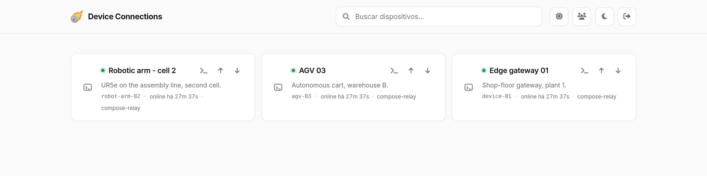
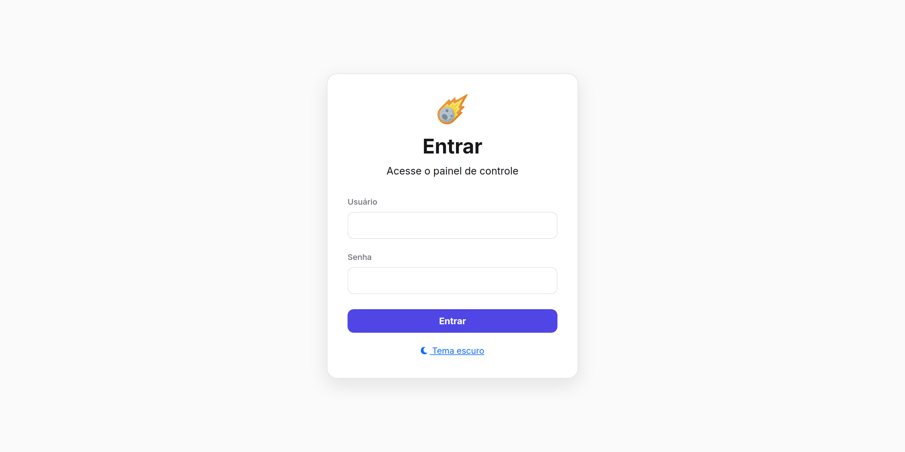
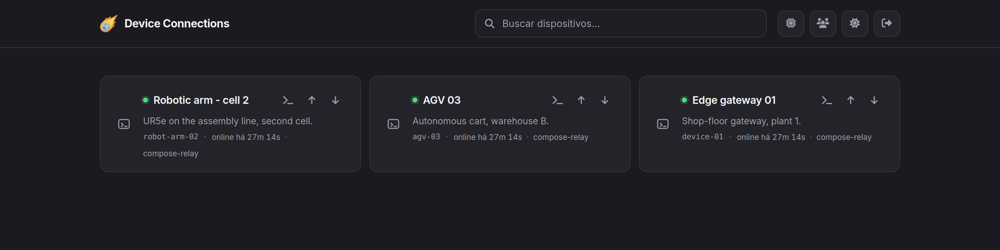
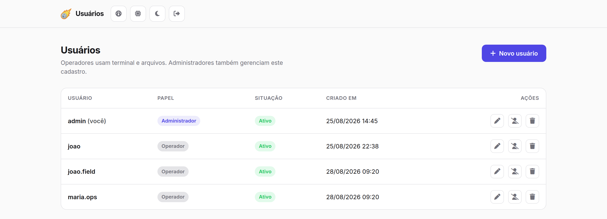
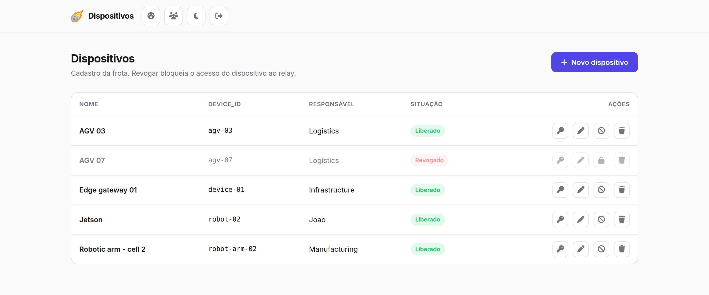
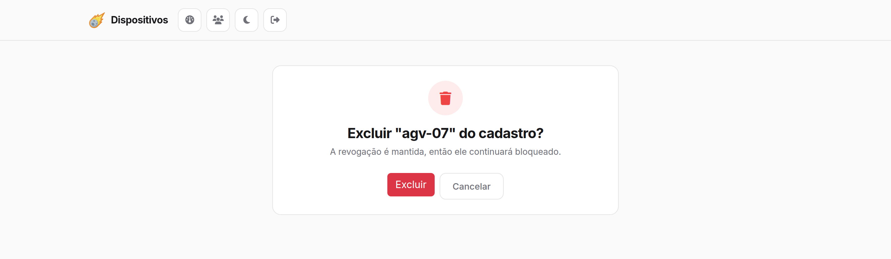

# Web Device Connections

[](LICENSE)
[](server/requirements.txt)

Remote device management with an interactive terminal and file transfer over WebSocket. The relay scales horizontally on Kubernetes; the frontend and the clients run separately.



## Architecture

```
             ┌─── HTTP (same origin, cookie) ────►  Frontend  ──── internal HTTP ──┐
Browser ─────┤                                      (login, session, grants)       ▼
             └─── WSS (signed grant) ───────────►  Ingress (hash by device_id) ─► relay (N pods)
                                                                                   │ WSS
                                                                                 Device
```

Three independent components:

| Component | Where it runs | Role |
|---|---|---|
| `frontend/` | Local Docker, or a pod | Pages, login, session, grants, and the user and device registries (Postgres) |
| `server/` | Kubernetes, N replicas | Pure relay. No login, no users, no passwords, no database. |
| `client/` | On each device | Agent with a PTY and file transfer |

### Who authenticates what

The relay does not authenticate people. It answers two narrower questions:

- **Is this really that device?** The token is `HMAC-SHA256(DEVICE_MASTER_SECRET, device_id)`. Nothing is stored, and a token leaked from one device does not open another device's session.
- **Did the frontend authorize this session?** The frontend handles the login and, with the user authenticated, signs a short-lived **grant** naming one device and one purpose. The relay checks the signature and burns the `jti`, so a grant that shows up in an access log cannot be used twice.

Everything about people — credential store, password hashing, session — lives in the frontend. Since browser and frontend share an origin, the session is an `HttpOnly` cookie: no script can reach the token.

The frontend also fetches the device list server-to-server. That way the browser **never makes a cross-origin HTTP request**, and the relay needs no CORS at all. The only direct browser→relay connection is the WebSocket, which carries the grant.

### How routing works

The `device_id` is in the URL of all four WebSocket routes (`/device/{id}`, `/terminal/{id}`, `/file/{id}`, `/download/{id}`). The ingress extracts that segment and uses it as the hash key, so the device and the browser sessions targeting it always land on the **same pod**. No extra hop on the data path.

> **Scale with replicas, never with `uvicorn --workers N`.** Several workers share one port and the kernel picks between them arbitrarily — the ingress cannot address a specific worker.

## Requirements

- Docker and Docker Compose (to run the local stack, or just the relay)
- Python 3.9+ to run `tools/` and scripts outside a container (3.11 recommended — it is the version tested in CI)
- `kubectl` and access to a cluster with ingress-nginx, for the Kubernetes deploy

## Running locally

```bash
# 1. Generate the secrets
python -c "import secrets; print('RELAY_SECRET=' + secrets.token_urlsafe(32))"
python -c "import secrets; print('SESSION_SECRET=' + secrets.token_urlsafe(32))"
python -c "import secrets; print('DEVICE_MASTER_SECRET=' + secrets.token_urlsafe(32))"

# 2. Fill in both .env files — RELAY_SECRET must be identical in the two
cp server/.env.example server/.env
cp frontend/.env.example frontend/.env

# 3. Bring it up
docker compose up -d

# 4. Mint the device token
cd server && python -m tools.mint_device_token device-01 --env
```

On the device, install the agent (systemd, automatic restart, logs in journald):

```bash
sudo ./deploy/client/install.sh
# fill in DEVICE_ID, DEVICE_TOKEN and SERVER_URL in /etc/wdc-client/client.env
sudo systemctl start wdc-client && journalctl -u wdc-client -f
```

By default the agent only reads and writes files inside the user's home
(`ALLOWED_ROOTS`); any path outside it is refused on the device itself, even if
the relay asks for it.

Open `http://localhost:3000`. On the first start an `admin` / `admin` account is seeded; change the password through the interface itself, under **Usuários** (Users).



The theme is a server-read cookie, so the whole application follows it — including
the first byte of HTML, which is why the page never flashes the wrong palette:



## How the frontend is organized

MVC, with one extra layer in the middle:

```
app/controllers/   turns a request into a response
app/services/      the rules, independent of HTTP
app/models/        what is stored, and how it is read and written
app/views/         templates, assets and how a page is assembled
```

Dependencies point one way only. A controller reaches services, models and views;
a service reaches models; models and views reach nothing beyond `config`. Anything
that would need an arrow pointing up is in the wrong layer.

**Why `services/` exists.** Pure MVC would leave the rules in the model or in the
controller. The model knows how to *write a row*; it has no reason to know that
writing that particular row would leave the system with nobody able to administer
it. And putting that in the controller would tie the rule to the HTTP shape — the
same guard applies to a command line tool or a migration script. Each refusal is a
`RuleError` whose message is already written for the operator, because that message
is exactly what goes to the screen.

**Where to look for each thing:**

| Question | File |
|---|---|
| Which route serves `/manage/devices/{id}/revogar`? | `app/controllers/devices.py` |
| Who can demote an administrator? | `app/services/users.py` |
| How is the device token obtained? | `app/services/relay.py` |
| What columns does the `devices` table have? | `app/models/device.py` |
| How is a date formatted? | `app/views/__init__.py` |
| Where does `RELAY_WS_URL` come from? | `app/config.py` |

The relay (`server/`) follows the same skeleton — `main.py` at the root, an `app/`
package, `tools/` — but with `routers/` and `core/` instead of MVC. It has no models
at all: it stores nothing, it only verifies tokens and grants and forwards bytes.
Naming folders `models/` and `views/` there would be inventing empty layers.

### Configuration

All configuration for both processes goes through a pydantic-settings `Settings`
— `frontend/app/config.py` and `server/app/core/config.py` — read from the
environment and from `.env`, with each default written next to what it means.
There is no `os.getenv` scattered through the code.

## Where the pages are assembled

On the server, in Jinja. The browser runs JavaScript only where it is the only
piece capable of doing the job:

| File | Why it has to be in the browser |
|---|---|
| `script.js` | Slices the file, pushes the chunks over the WebSocket, handles backpressure and checks the SHA-256 of the download. The bytes never pass through the frontend. |
| `common.js` | Toast and transfer-progress modal — the result arrives later, asynchronously. |
| `api.js` | Requests the grant and opens the WebSocket against the relay. |
| `terminal.html` | xterm.js. A terminal is interactive by definition. |

Everything else — listing, filtering, forms, validation, showing errors — is HTML
that arrives ready from Python. Two pages (`/manage/users`, `/manage/devices` and
their forms) load **no** `<script>` at all, and the Bootstrap JavaScript bundle is
no longer used anywhere: only the stylesheet.

Three details that follow from this:

- **Theme.** It is a cookie the server reads, not `localStorage`. `data-theme` is
  already correct in the first byte of HTML, so the page never flashes the wrong
  palette before a script fixes it.
- **Search.** The `?q=` is filtered in Python and stays in the address bar, so
  reloading or bookmarking keeps the filter. It also matches the **registered
  name**, something the old JavaScript filter did not do — it only knew the
  `device_id`.
- **Dates.** They used to be formatted by the browser, in the timezone of whoever
  opened the page. Now they come from the server in `DISPLAY_TZ` (default
  `America/Sao_Paulo`), so the same row reads the same for the whole team.

The dashboard's card grid still refreshes every 5 s, but what it fetches is **HTML**
(`/partials/devices`), rendered by the same Jinja include as the full page. There is
no second definition of "what a card looks like" living in JavaScript to drift from
that one.

## Users and devices

Two pages, both restricted to administrators, reached through the icons at the top of the dashboard.

**Users** (`/manage/users`) — two roles:

| Role | Can |
|---|---|
| Operator | Terminal, upload and download on any device |
| Administrator | The same, plus managing users and the device registry |



Deactivating is preferable to deleting: it preserves the history of who did what and still blocks the login. The last active administrator cannot be demoted, deactivated or deleted, and nobody can remove their own admin access — without that it is easy to lock yourself out of the system with one click.

The role travels inside the session cookie, so a role change only takes effect on the user's next login.

**Devices** (`/manage/devices`) — the fleet registry, with name, owner, description, the provisioning token and revocation.



The dashboard shows who is **online**; this page shows who is **registered**. A device can be online without appearing here, because the relay accepts any `device_id` whose derived token is valid — and the dashboard flags those cases, which is exactly what you want to notice.

### Revocation

Revoking disconnects the device within 15 seconds and prevents it from authenticating again. How it works, and why it works that way:

Postgres is the source of truth, but the relay does **not** query it — it has to keep working if the frontend goes down. So the frontend mirrors revocations into Redis (`wdc:revoked:<device_id>`), which the relay already uses for presence and burned grants.

The check **fails open**: if Redis is unreachable, the relay accepts the device. Locking the whole fleet out because of a Redis hiccup would be far more damage than honouring a revoked token for a few minutes. The counterweight is that the frontend republishes every revocation on startup, so a data loss in Redis corrects itself.

Two consequences worth knowing:

- **Deleting from the registry does not revoke.** The relay authenticates by the derived token, not by the table. Revoke first if the intent is to take the device off the air — the interface says so in the confirmation. A revoked device *keeps* its revocation when deleted.
- **For a guaranteed, immediate block**, rotate `DEVICE_MASTER_SECRET` and re-issue the fleet's tokens. Revocation is eventually consistent by construction.

Destructive actions get a confirmation page of their own, which is also where that
distinction is spelled out:



## Testing the relay on its own

`server/docker-compose.yml` brings up **three replicas** over a shared Redis, plus an nginx that reproduces the production ingress's `device_id` hashing. There are two entry points, and each one exposes a different property:

| Entry point | What it exercises |
|---|---|
| `:8080` — the ingress | Affinity. The device and the browser sessions targeting it land on the **same** pod, as in production. |
| `:8001` `:8002` `:8003` — the replicas | Cross-pod behaviour. Connect on A and list from B to prove that presence is shared. |

```bash
cd server
cp .env.example .env      # RELAY_SECRET and DEVICE_MASTER_SECRET
docker compose up -d

python scripts/smoke.py                                       # crosses replicas
python scripts/smoke.py --a http://localhost:8080 --b http://localhost:8080   # through the ingress
```

The hashing rule lives in `nginx/ingress.conf`. It uses `map` instead of the `if`+`set` of `deploy/k8s/server.yaml` — same key, but ingress-nginx injects its snippet inside the `location` block, where `map` is not allowed. To watch the hash at work, the local nginx returns two headers that have no production equivalent:

```bash
curl -sI http://localhost:8080/device/device-01 | grep -i x-relay
# X-Relay-Upstream: 192.168.48.3:8000
# X-Relay-Hash-Key: device-01
```

The same key always resolves to the same pod; different keys spread out. That is exactly what a round-robin Service does *not* do.

The smoke script plays both roles: it authenticates a fake device on replica A, signs a grant the way the frontend would and redeems it on replica B, verifying that presence is shared, that the relay delivers in both directions, and that a reused grant is refused.

```
✓ réplica A: pod=relay-a presença=redis multi-réplica=True
✓ réplica B: pod=relay-b presença=redis multi-réplica=True
✓ dispositivo autenticado na réplica A (pod relay-a)
✓ réplica B lista o dispositivo da A (dono: relay-a)
✓ grant aceito e sessão de terminal relayada até o dispositivo
✓ saída do dispositivo voltou pela sessão do navegador
✓ grant reutilizado foi recusado
✓ dispositivo saiu da lista ao desconectar
```

## Deploying on Kubernetes

```bash
kubectl create secret generic wdc-postgres \
  --from-literal=POSTGRES_USER=wdc \
  --from-literal=POSTGRES_PASSWORD="$(openssl rand -base64 24)" \
  --from-literal=POSTGRES_DB=wdc

kubectl create secret generic wdc-shared-secrets \
  --from-literal=RELAY_SECRET="$(openssl rand -base64 32)" \
  --from-literal=SESSION_SECRET="$(openssl rand -base64 32)" \
  --from-literal=DEVICE_MASTER_SECRET="$(openssl rand -base64 32)" \
  --from-literal=ADMIN_PASSWORD_HASH='<output of tools.hash_password>' \
  --from-literal=DATABASE_URL='postgresql+asyncpg://wdc:<the password above>@wdc-postgres:5432/wdc'

kubectl apply -f deploy/k8s/redis.yaml
kubectl apply -f deploy/k8s/postgres.yaml
kubectl apply -f deploy/k8s/server.yaml
kubectl apply -f deploy/k8s/frontend.yaml
```

`ADMIN_PASSWORD_HASH` is used **once**, to seed the first account when the users table is empty. After that the accounts live in the database and the variable is ignored — rotating it does not reset a password that has since been changed through the interface.

The block that implements the routing is in `deploy/k8s/server.yaml`:

```yaml
nginx.ingress.kubernetes.io/configuration-snippet: |
  set $dev_id "";
  if ($request_uri ~* "^/(?:device|terminal|file|download)/([^/?]+)") {
    set $dev_id $1;
  }
nginx.ingress.kubernetes.io/upstream-hash-by: "$dev_id"
```

Hashing by `$request_uri` does **not** work: `/device/device-01` and `/terminal/device-01` are different URIs and would land on different pods. For the same reason, the frontend's `RELAY_WS_URL` must point at the **ingress**, never at the Service — the Service round-robins and the upgrade would land on the wrong replica.

**When scaling or deploying**, the hash ring changes and some devices start belonging to a different pod. They reconnect on their own, but terminal sessions open at that moment drop.

## Routes

**Frontend** (same origin as the browser, cookie session)

| Method | Path | Description | Role |
|---|---|---|---|
| `GET/POST` | `/login` | Form and credential check | — |
| `GET` | `/logout` | Ends the session | — |
| `GET` | `/?q=` | Dashboard; `q` filters the fleet, on the server | any |
| `GET` | `/partials/devices?q=` | Just the card grid, for the periodic refresh | any |
| `GET` | `/terminal?device=` | Terminal | any |
| `POST` | `/ws-grant` | Signs a single-use grant | any |
| `GET` | `/theme?to=&next=` | Stores the theme preference in a cookie | — |
| `GET` | `/config.js` | Relay URL for the browser | — |
| `GET` | `/manage/users` | User list | admin |
| `GET` | `/manage/users/novo`, `/manage/users/{id}` | Create and edit forms | admin |
| `POST` | `/manage/users`, `/manage/users/{id}` | Creates and saves | admin |
| `POST` | `/manage/users/{id}/{ativar,desativar,excluir}` | Row actions (activate, deactivate, delete) | admin |
| `GET` | `/manage/devices` | Fleet registry | admin |
| `GET` | `/manage/devices/novo`, `/manage/devices/{id}` | Forms | admin |
| `GET` | `/manage/devices/{id}/token` | Provisioning token | admin |
| `POST` | `/manage/devices`, `/manage/devices/{id}` | Registers and saves | admin |
| `POST` | `/manage/devices/{id}/{revogar,liberar,excluir}` | Row actions (revoke, release, delete) | admin |

Every action that changes something is a form `POST` answered with a `303`, and the
result message crosses that redirect in a short-lived cookie. Two practical
consequences: reloading the page does not repeat the operation, and a stray `GET` —
a prefetch, a crawler — cannot revoke or delete anything.

Destructive actions (`excluir`, `revogar`) get a **confirmation page** on `GET`
before the `POST`, because what is at stake does not fit in a line of
`window.confirm`.

**Relay** (no login; nothing here is meant for a browser to call directly over HTTP)

| Method | Path | Credential |
|---|---|---|
| `GET` | `/health` | — |
| `GET` | `/devices` | `X-Relay-Secret` (internal call) |
| `GET` | `/devices/{id}/token` | `X-Relay-Secret` (internal call) |
| `WS` | `/device/{id}` | Device token |
| `WS` | `/terminal/{id}` | Grant, scope `terminal` |
| `WS` | `/file/{id}` | Grant, scope `upload` |
| `WS` | `/download/{id}` | Grant, scope `download` |

Each grant is bound to a `device_id` **and** to a scope: an upload grant does not open a shell.

## Structure

```
web_device_connections/
├── frontend/                 MVC — see "How the frontend is organized"
│   ├── main.py               entrypoint (`uvicorn main:app`)
│   ├── app/
│   │   ├── config.py         a single settings model (env + .env)
│   │   ├── main.py           assembles the application: lifespan, static, routers
│   │   ├── controllers/      base.py (guards and render), auth, dashboard,
│   │   │                     users, devices
│   │   ├── services/         security (password, session, grants), users, devices,
│   │   │                     relay (HTTP client), revocation, errors
│   │   ├── models/           base (engine/session), user, device
│   │   └── views/
│   │       ├── templates/    _layout, _macros, _device_cards, index, login,
│   │       │                 terminal, users, user_form, devices,
│   │       │                 device_form, device_token, confirm
│   │       ├── static/       style.css and the little JS that remains:
│   │       │                 api.js (grant + fetch), common.js (toast/modal),
│   │       │                 script.js (upload/download)
│   │       └── __init__.py   Jinja, date/uptime filters, theme, flash
│   └── tools/hash_password.py
├── server/
│   ├── app/
│   │   ├── routers/          devices.py, terminal.py, files.py
│   │   ├── state.py          live sockets (local to the process)
│   │   └── core/
│   │       ├── presence.py   Redis or memory: presence + burned grants
│   │       ├── security.py   device tokens, grant verification
│   │       └── config.py
│   ├── tools/mint_device_token.py
│   ├── scripts/smoke.py
│   ├── tests/                31 tests
│   ├── nginx/ingress.conf    device_id hashing, mirror of the k8s ingress
│   ├── docker-compose.yml    3 replicas + redis + nginx, to test the relay alone
│   └── main.py
├── client/
│   ├── wdc_client/
│   │   ├── config.py         typed settings, validated at startup
│   │   ├── paths.py          roots allowed for reading and writing
│   │   ├── shell.py          PTY sessions, process limit and reaping
│   │   ├── transfer.py       receiving and sending files
│   │   ├── connection.py     handshake, dispatch and reconnection backoff
│   │   ├── protocol.py       message types and error codes
│   │   └── __main__.py       entrypoint, shutdown on SIGTERM
│   └── tests/                73 tests
├── deploy/
│   ├── k8s/                  server.yaml (ingress + hash), frontend.yaml,
│   │                         redis.yaml, postgres.yaml
│   └── client/               systemd unit + install.sh for the devices
├── docs/images/              screenshots used in this README
└── docker-compose.yml        full stack
```

## Tests

```bash
cd server && pip install -r requirements-dev.txt && pytest
cd client && pip install -r requirements-dev.txt && pytest
```

On the relay: device token derivation, the grant lifecycle (signing, expiry, binding to device and scope, single use, failing closed without a secret), the `Origin` check, and an end-to-end test that connects a device and verifies the relay in both directions.

On the client: the allowed roots (traversal, symlink, sibling prefix), the size limit on receive, the checksum and cancellation cycle, backoff with jitter, the dispatch that does not drop the connection when a message arrives malformed, and real PTY sessions — including a shell that ignores `SIGTERM` and the process being reaped instead of turning into a zombie.

## Limitations

- Revocation is eventually consistent: the relay reads from Redis, and a data loss there frees the device until the frontend resyncs on startup. For a guaranteed block, rotate `DEVICE_MASTER_SECRET` and re-issue the tokens
- The schema is created with `create_all`; adding a column works, but altering or removing one calls for Alembic
- Files still travel through the pod in 64 KB chunks — for high volumes, signed object-storage URLs would take the bytes out of the control plane
- Bootstrap (CSS only), Font Awesome and xterm.js come from a CDN. The pages keep working unstyled if the CDN fails, but the terminal does not work without xterm — on restricted networks, serve those files alongside the application
- No per-device access control: whoever logs in operates the whole fleet
- There is no longer a JSON API for users and devices: the `/api/*` endpoints existed only to feed the JavaScript that was removed, and keeping them would be two descriptions of the same rule. The rules live in `frontend/services.py`, ready for an API to come back on top of them if it is ever needed
- `.github/workflows/ci.yml` still reflects the layout from before the split into three components (it installs the root `requirements.txt` and builds a single Docker image); it needs updating to run lint/tests/build per component (`server/`, `frontend/`, `client/`)

## License

MIT — see [LICENSE](LICENSE).
